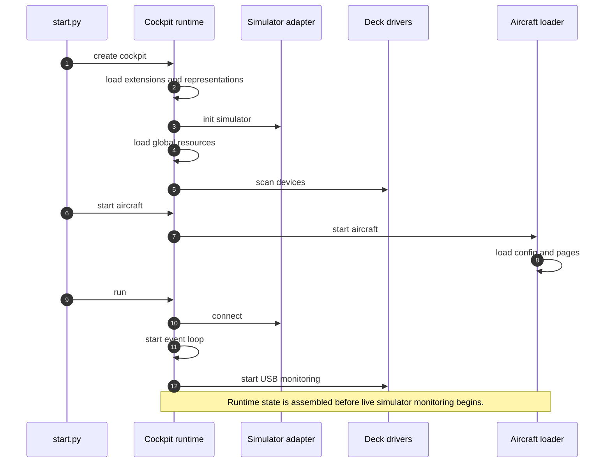
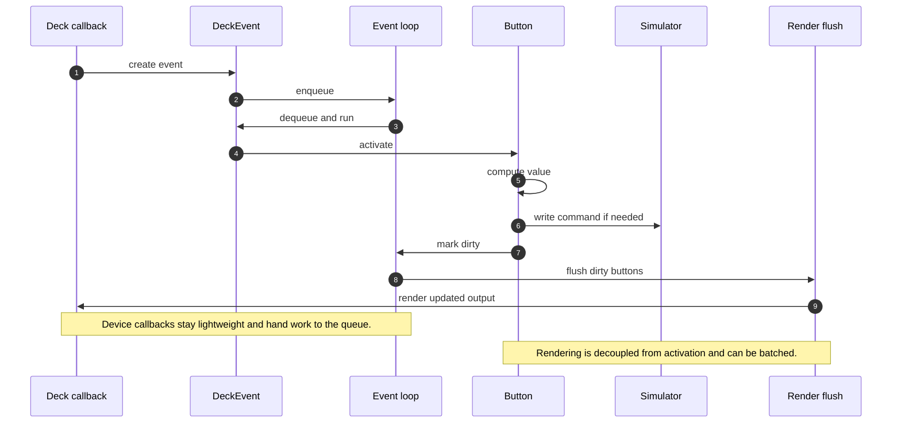
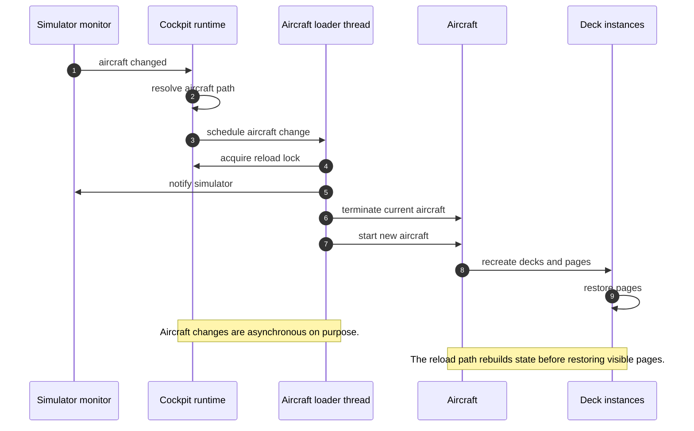
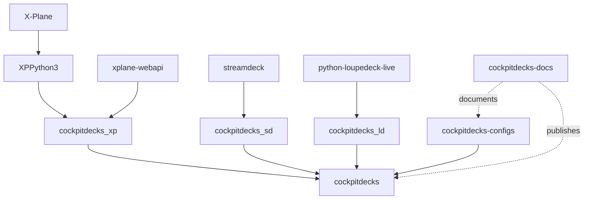

# Diagrams

This page collects the highest-value sequence views of Cockpitdecks.

These are intentionally lightweight and are meant to complement the prose in
`runtime-flow.md`.

## Startup

## Deck Event To Render

## Aircraft Change And Reload

## Repository Boundary Map

